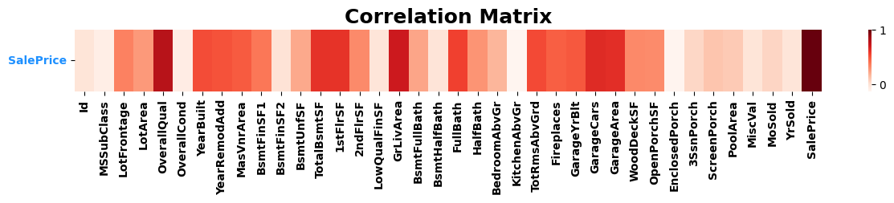
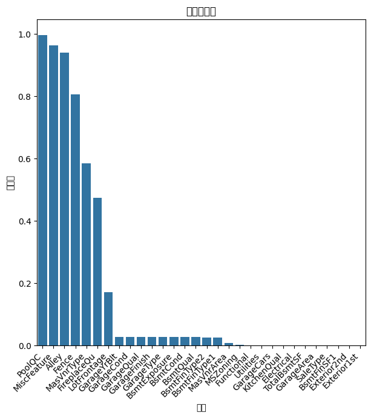

# Home Price Prediction


這段程式碼是針對 Kaggle 的房價預測競賽，使用 Python 實現了一個學習模型。以下是對這個學習架構的簡要描述：

## 資料理解
在進行資料分析及建模前，下載建模用的資料集及schema。透過閱讀schema，將變數大致分為以下類別：
#### 1. 建物面積：
   - `1stFlrSF`（一樓面積）、`GrLivArea`（一樓以上總生活空間）、`TotalBsmtSF`（地下室總面積）等。

#### 2. 裝置數量：
   - `FullBath`（完整浴室數量）、`Kitchen`（廚房數量）、`Bedroom`（臥室數量）等。

#### 3. 量表型類別特徵：
   - `ExterCond`（外部狀態）、`ExterQual`（外觀材質）、`GarageQual`（車庫品質）等。
      這類型特徵的值為Excellent/Good/Averege/Fair/Poor等，具有順序特性。

#### 4. 一般類別特徵：
   - `Neighborhood`（所在區域）、`HouseStyle`（房屋型式）等。
     
在進行探索性資料分析（EDA）和實際建模之前，理解資料型態很重要。資料本身可能隱含了豐富的領域知識，這些資訊與後續的特徵工程處理手法密切相關。

## 相關係數確認
將train_df的數值特徵跟預測變數(SalePrice)的相關係數矩陣，然後把相關性最高的幾個特徵列出來，並刪除相關性低的特徵(相關係數小於0.3)。
```python
# 相關性熱點圖
num_data_train = train_df.select_dtypes(include=['int', 'float'])

# 計算相關性
num_corr = num_data_train.corr()

# 調整圖形大小
fig, ax = plt.subplots(figsize=(15, 1))

# 繪製相關性熱點圖
sns.heatmap(num_corr.sort_values(
    by=['SalePrice'], ascending=False).head(1), cmap='Reds')

# 設置標題和軸標籤
plt.title("Correlation Matrix", weight='bold', fontsize=18)
plt.xticks(weight='bold')
plt.yticks(weight='bold', color='dodgerblue', rotation=0)

# 找出相關性小於0.3的特徵
low_corr_features = num_corr['SalePrice'][num_corr['SalePrice'] < 0.3].index

# 刪除相關性小於0.3的特徵
train_df = train_df.drop(low_corr_features, axis=1)
```

## 極端值處理
找出train_df裡的數值型特徵中屬於常態分佈的，並刪除其兩個標準差以外的值(留其95%信賴區間)
```python
# 極端值處理
num_train_data = train_df.select_dtypes(include=['int', 'float'])

# 找出常態分佈的features
normal_distributed_features = []
for feature in num_train_data:
    stat, p_value = shapiro(train_df[feature])
    if p_value > 0.05:
        normal_distributed_features.append(feature)

# 刪除於常態分佈features中95%區間外的值
for feature in normal_distributed_features: 
    mean_val = train_df[feature].mean()
    std_val = train_df[feature].std()
    lower_bound = mean_val - 1.96 * std_val
    upper_bound = mean_val + 1.96 * std_val

    # 刪除超出區間的值
    clean_train_df = train_df[(train_df[feature] >= lower_bound) & (
        train_df[feature] <= upper_bound)]
```
## 遺漏值檢查
將合併test_df及train_df的data進行遺漏值的檢查，若遺漏值太多，則刪除該特徵。
```python
# 遺漏值確認
missing_columns = data.isnull().mean().sort_values(ascending=False)
missing_columns = missing_columns[missing_columns !=
                                  0].to_frame().reset_index()

# 遺漏率繪圖
fig, ax = plt.subplots(figsize=(7, 7))
sns.barplot(x='index', y=0, data=missing_columns)
ax.set(xlabel='特徵', ylabel='遺漏率', title='特徵遺漏率')
plt.xticks(rotation=45, ha="right")  # 調整標籤旋轉角度
```


## EDA (Exploratory Data Analysis)
用KDE(kernel density estimation) 來細看個別特徵的詳細分布情形，作為後續特徵工程的參考：
- 數值型特徵

#### 1. 運用KNN(K Nearest Neighbors))填補缺失值
```python
# 數值型特徵填補缺失值
num_data = data.select_dtypes(include=['int', 'float'])

# 使用 fill_nan_by_knn 函式填補缺失值
data_fill = fill_nan_by_knn(num_data, 3, "skip")

# 覆蓋原始數據中的相應部分
data.loc[:, num_data.columns] = data_fill
```
#### 2. 標準化
```python
# 數值型特徵標準化
num_data_col = data.select_dtypes(include=['int', 'float']).columns
scaler = StandardScaler()
data[num_data_col] = scaler.fit_transform(data[num_data_col])
```
- 類別型特徵 

#### 1. 刪除集中單一類別的特徵
```python
data.drop(["Street", "Utilities", "LandSlope", "Condition2",
          "RoofMatl", "Heating", "Functional"], axis=1, inplace=True)
```
#### 2. 特徵工程
雖為類別特徵，但其實有順序性，故在這裡會把這類型的特徵轉成順序特徵
```python
# 處理object feature

# lebel encoding
columns_to_fillna = ['ExterQual', 'BsmtQual', 'HeatingQC',
                     'KitchenQual', 'FireplaceQu', 'BsmtExposure', 'BsmtFinType1']

# 使用fillna進行缺失值填充
data[columns_to_fillna] = data[columns_to_fillna].fillna('none')

for i in ['ExterQual', 'HeatingQC', 'KitchenQual', 'FireplaceQu']:
    data[i] = data[i].replace(['Ex', 'Gd', 'TA', 'Fa', 'Po', 'none'], [
                              5, 4, 3, 2, 1, 0]).astype(int)

for i in ['BsmtExposure']:
    data[i] = data[i].replace(['Gd', 'Av', 'Mn', 'No', 'none'], [
                              4, 3, 2, 1, 0]).astype(int)

for i in ['BsmtFinType1']:
    data[i] = data[i].replace(['GLQ', 'ALQ', 'BLQ', 'Rec', 'LwQ', 'Unf', 'none'], [
                              6, 5, 4, 3, 2, 1, 0]).astype(int)

# one-hot encoding
finish_data = pd.get_dummies(data, dtype=int)
```
## 模型預測

### 單一模型建模
**Level-1 模型：Ridge、Lasso、Elastic Net**
- 在第一層，選擇了三種回歸模型，分別是 Ridge、Lasso 和 Elastic Net。這些模型被用於預測目標變數（房價）。
#### 1. Ridge
```python
# Ridge regression
# 設定交叉驗證的alpha值
alpha = [0.0001, 0.001, 0.01, 0.1, 1, 10, 100]

# 使用RidgeCV進行模型建構，設定交叉驗證(cv=5)
ridge = RidgeCV(alphas=alpha, cv=5)

# 在訓練集上擬合模型
ridge_fit = ridge.fit(x_train, y_train)

# 預測訓練集和測試集
y_ridge_train = ridge_fit.predict(x_train)
y_ridge_test = ridge_fit.predict(x_test)

# 評估模型表現 (RMSE)
print('RMSE_train_Ridge = ' +
      str(math.sqrt(sklm.mean_squared_error(y_train, y_ridge_train))))
print('RMSE_test_Ridge = ' +
      str(math.sqrt(sklm.mean_squared_error(y_test, y_ridge_test))))
```


#### 2. Lasso
```python
# Lasso regression
# 設定交叉驗證的 alpha 值
alpha = [0.0001, 0.001, 0.01, 0.1, 1, 10, 100]

# 使用 LassoCV 進行模型建構，設定交叉驗證(cv=5)
Lasso = LassoCV(alphas=alpha, cv=5, max_iter=10000)

# 在訓練集上擬合模型
Lasso_fit = Lasso.fit(x_train, y_train)

# 預測訓練集和測試集的目標值
y_lasso_train = Lasso_fit.predict(x_train)
y_lasso_test = Lasso_fit.predict(x_test)

# 計算並輸出訓練集和測試集的 RMSE
print('RMSE_train_Lasso = ' +
      str(math.sqrt(sklm.mean_squared_error(y_train, y_lasso_train))))
print('RMSE_test_Lasso = ' +
      str(math.sqrt(sklm.mean_squared_error(y_test, y_lasso_test))))
```

#### 3. Elastic Net
```python
# ElasticNet
# set cross-validation alpha and l1ratio
alpha = [0.0001, 0.001, 0.01, 0.1, 1, 10, 100]
l1ratio = [0.1, 0.5, 0.9, 0.95, 0.99, 1]
# find the best alpha/l1ratio and build model
elastic_cv = ElasticNetCV(cv=5, max_iter=1000000,
                          alphas=alpha,  l1_ratio=l1ratio)
elastic_fit = elastic_cv.fit(x_train, y_train)
y_el_train = elastic_fit.predict(x_train)
y_el_test = elastic_fit.predict(x_test)
# validation( train data and validate data)
print('RMSE_train_ElasticNet = ' +
      str(math.sqrt(sklm.mean_squared_error(y_train, y_el_train))))
print('RMSE_test_ElasticNet = ' +
      str(math.sqrt(sklm.mean_squared_error(y_test, y_el_test))))
```

**Level-2 模型：Voting 和基於 GBDT 的 Stacking**
- 在第二層，使用 VotingRegressor 將前一層的三個模型整合在一起。同時，也使用了以 Gradient Boosting Decision Tree (GBDT) 為基礎的 StackingRegressor，將前一層的模型作為子模型進行集成。
#### 1. VotingRegressor
```python
# Build Model (voting)
vote_mod = VotingRegressor(
    [('Ridge', ridge_fit), ('Lasso', Lasso_fit), ('Elastic', elastic_fit)])
vote = vote_mod.fit(x_train, y_train.ravel())
# predict train/test y
vote_pred_train = vote.predict(x_train)
vote_pred_test = vote.predict(x_test)
# validation( train data and validate data)
print('RMSE_train_Voting = ' +
      str(math.sqrt(sklm.mean_squared_error(y_train, vote_pred_train))))
print('RMSE_test_Voting = ' +
      str(math.sqrt(sklm.mean_squared_error(y_test, vote_pred_test))))
```

#### 2. StackingRegressor
```python
# stack
gbdt = GradientBoostingRegressor(learning_rate=0.05,
                                 max_leaf_nodes=3,
                                 n_estimators=100)
stregr = StackingRegressor(regressors=[ridge_fit, Lasso_fit, elastic_fit],
                           meta_regressor=gbdt,
                           use_features_in_secondary=True)
stack_mod = stregr.fit(x_train, y_train.ravel())
# predict train/test y
stacking_pred_train = stack_mod.predict(x_train)
stacking_pred_test = stack_mod.predict(x_test)
# # validation( train data and validate data)
print('RMSE_train_Stacking = ' +
      str(math.sqrt(sklm.mean_squared_error(y_train, stacking_pred_train))))
print('RMSE_test_Stacking = ' +
      str(math.sqrt(sklm.mean_squared_error(y_test, stacking_pred_test))))
```

**Level-3 模型：Blending**
- 在第三層，將前一層的 Voting 和 Stacking 模型進行 Blending。Blending 是一種集成學習的技術，通過線性加權將不同模型的預測結果混合在一起，以獲得最終預測結果。
```python
# blend
# 設定權重列表
weights = np.linspace(0.1, 1, 91)

# 初始化結果列表
blending_results = []

# 使用不同權重進行混合，計算訓練集和測試集的 RMSE
for weight in weights:
    blending_pred_train = weight * vote_pred_train + \
        (1 - weight) * stacking_pred_train
    blending_pred_test = weight * vote_pred_test + \
        (1 - weight) * stacking_pred_test
    train_rmse = math.sqrt(sklm.mean_squared_error(
        y_train, blending_pred_train))
    test_rmse = math.sqrt(sklm.mean_squared_error(y_test, blending_pred_test))
    blending_results.append(
        {'weight': weight, 'train_rmse': train_rmse, 'test_rmse': test_rmse})

# 轉換成資料框
blending_output = pd.DataFrame(blending_results)

# 輸出前 10 個具有最低測試集 RMSE 的權重值
top_10_weights = blending_output.sort_values(by='test_rmse').head(10)
print(top_10_weights)
```

這樣的三層模型架構旨在提升整體模型的效果和穩定性。使用不同層次的模型進行集成，有助於充分利用各個模型的優勢，提高對房價預測的準確性。最終的預測結果經過 Blending 的加權處理，得到一個更為綜合和強健的模型。

## 預測結果
```python
# predict and blending
# 最終預測
final_pred_voting = vote.predict(Test)
final_pred_stacking = stack_mod.predict(Test)
final_pred_blending = 0.4 * final_pred_voting + 0.6 * final_pred_stacking

# 反轉 log(y)
final_pred_blending = np.expm1(final_pred_blending)

# 創建提交的資料框
submit = pd.DataFrame({'Id': range(1461, 2920, 1),
                       'SalePrice': final_pred_blending})
# 儲存為 CSV
submit.to_csv('submit.csv', index=False)
```


```

